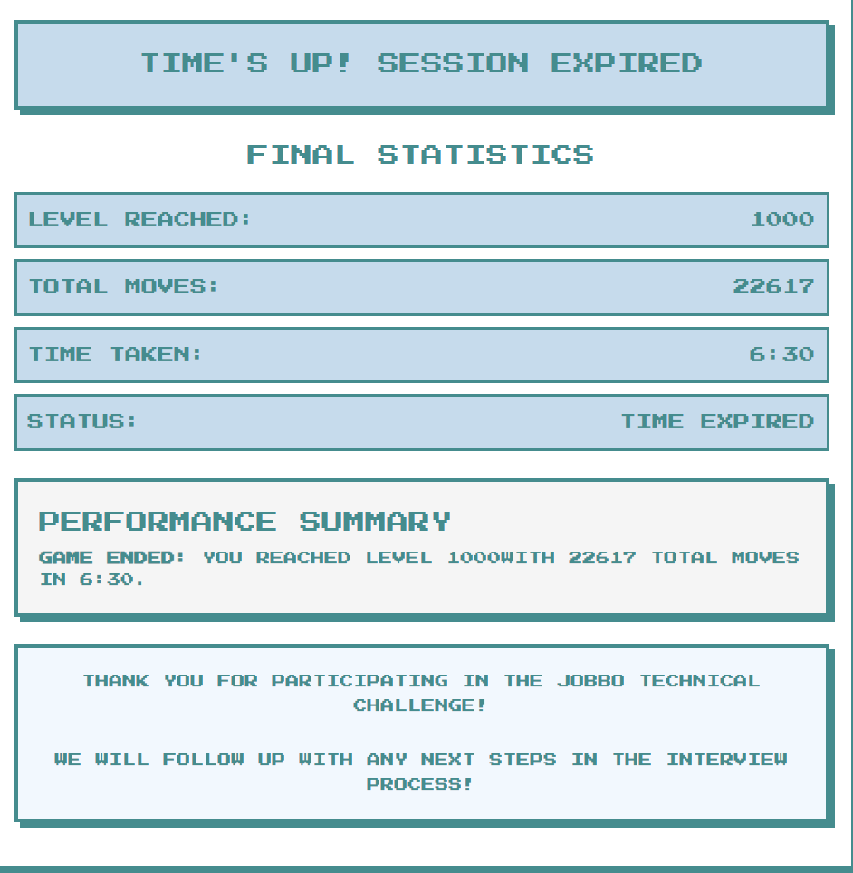

# 🕹️ JOBBO Technical Challenge Solver

This repository contains my automated solution to the **JOBBO Technical Challenge**, a timed puzzle game where the goal is to collect apples in a grid-based environment with the fewest moves and shortest time.

---

## ✅ Challenge Summary

- **Levels**: 1000
- **Objective**: Reach the apple on each level
- **Phase 1**: Open fields
- **Phase 2**: Maze with walls
- **Scoring**: Fewer total moves + faster time = better rank
- **Time Limit**: 1 hour

---

## 🧠 My Approach

Instead of playing manually, I:
- Inspected the frontend using DevTools
- Found the game's API (`/game/:id/board`, `/submit`)
- Wrote a Python script to:
  - Fetch board data each level
  - Use **Breadth-First Search (BFS)** to find the shortest path from `P` to `A`
  - Avoid walls in Phase 2
  - Submit the move batch via API

---

## 🚀 Results

> ✅ Finished all **1000 levels**  
> 🧮 Total moves used: **22,617**  
> ⏱️ Completed in under 1 hour

### 📸 Final Screenshot:

 <!-- replace with your actual file name -->

---

## 📁 Files

| File | Description |
|------|-------------|
| `jobbo_solver.py` | Python script that solves the game automatically |
| `screenshot.png`  | Screenshot of final result (proof of completion) |
| `README.md`       | This file |

---

## 🎯 Key Takeaway

This challenge was about recognizing that the game **could be reverse engineered and automated**, not manually played.

It tested:
- API inspection
- Pathfinding algorithms
- Practical automation under constraints

---

## 🧠 Author

**Roger Yu**  
`roger_yu@berkeley.edu`

---

## 💬 Notes

I appreciated the cleverness of this challenge — it was more about thinking like a systems engineer than a player. Fun, fair, and satisfying to break.
